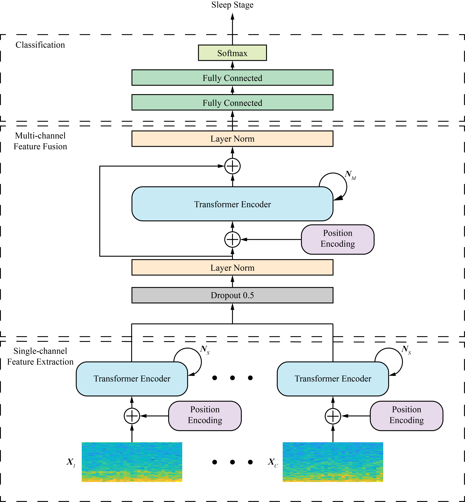

# MultiChannelSleepNet
### MultiChannelSleepNet: A Transformer-Based Deep Learning Method for Automatic Sleep Stage Classification With Multi-Channel PSG 
#### *by: Yang Dai, Shanshan Liang, Lukang Wang, Qingtian Duan, Hui Yang, Chunqing Zhang\*, Xiaowei Chen\*, and Xiang Liao\* 

## Abstract

Automatic sleep staging aims to classify sleep states by machine intelligence, which plays an essential role in the measurement of sleep quality and diagnosis of sleep disorders. Although many automatic methods have been proposed for accurate sleep staging, most of these approaches utilize only single channel EEG signals to classify sleep stages. Multi-channel polysomnography (PSG) data provide more information to train classifier and may achieve higher sleep staging performance. Here we propose a novel transformer encoder-based deep learning method named MultiChannelSleepNet for sleep stage classification with multi-channel PSG data. The proposed model architecture is implemented based on the transformer encoder for single-channel feature extraction and multi-channel feature fusion. In each single-channel feature extraction block, transformer encoders are used to extract features from time-frequency maps of each channel. Based on our integration strategy, the feature maps extracted from each channel are fused for further feature extraction. Transformer encoders and a residual connection are applied in this module to preserve original information of each channel. The experimental results on three public datasets show that our method outperforms state-of-the-art methods in terms of different evaluation metrics.

## Requirmenets:
- python3.6
- pytorch=='1.9.1'
- numpy
- sklearn
- scipy=='1.5.4'
- mne=='0.23.4'
- tqdm

## Data
We used three public datasets in this study:

- SleepEDF-20 (The first 39 records in SleepEDF-78)
- [SleepEDF-78](https://physionet.org/content/sleep-edfx/1.0.0/)
- [SHHS](https://sleepdata.org/datasets/shhs)

This project currently only provides pre-processing code for SleepEDF-20 and SleepEDF-78. We will update the code of SHHS later.  
After downloading the datasets, please place them in the folder with the corresponding name in the directory `dataset`.  
You can run the `dataset_prepare.py` to extract events from the original record (.edf)

## Reproducibility
If you want to update the training parameters, you can edit the `args.py` file. In this file, you can update:

- Device (GPU or CPU).
- Batch size.
- Number of folds (as we use K-fold cross validation).
- The number of training epochs.
- Parameters in our model (dropout rate, number of transformer encoder, etc)

To easily reproduce the results you can follow the next steps:  

1. Run `dataset_prepare.py` to extract events from the original record (.edf).
2. Run `data_preprocess_TF` to preprocess the data. The original signals will be converted to time-frequency images, and normalized.
3. Run `Kfold_trainer.py` to perform the standard K-fold cross validation.
4. Run `result_evaluate.py` to get the evaluation report. It concludes the various valuation metrics we described in paper.  

## Contact
Yang Dai  
Center for Neurointelligence, School of Medicine  
Chongqing University, Chongqing 400030, China  
Email: valar_d@163.com
